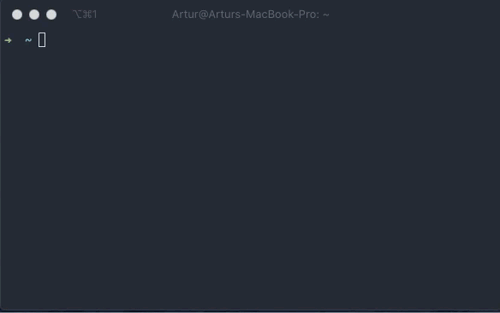
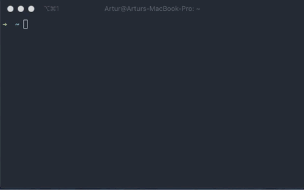
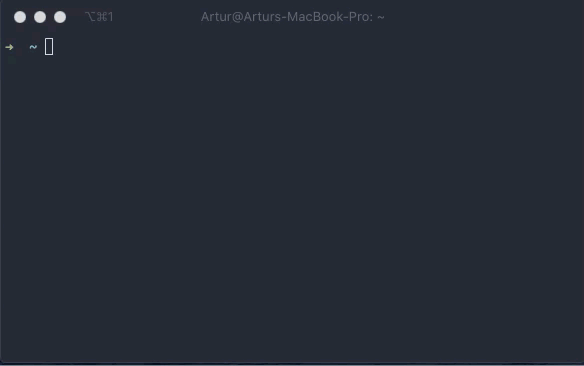

# clotp
Simple command-line Time-based One-time Password generator.

⚠️Work in progress⚠️

## Usage

```bash
clotp new
```


```bash
clotp new -verbose
```
`-verbose` flag allows you to specify some extra fields



### List your totp entities. Type for filtering
```bash
clotp list
```


